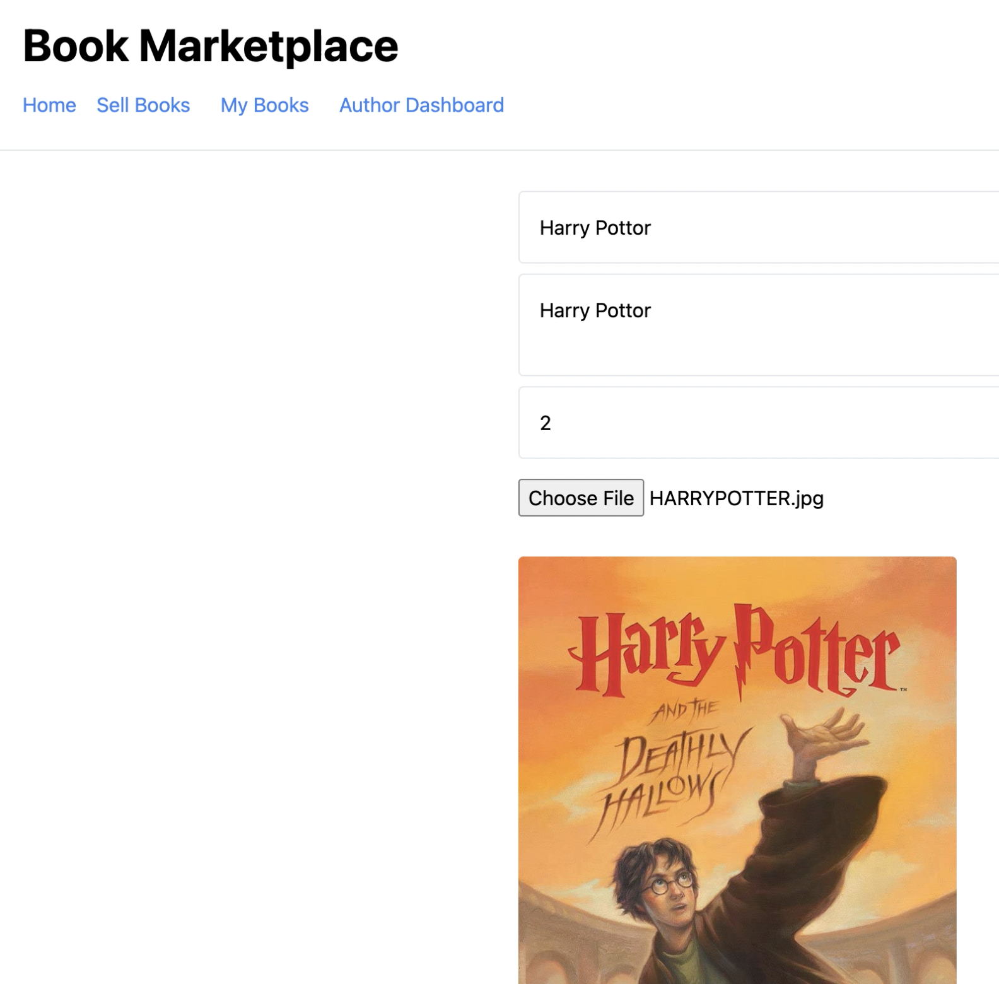

# Book martketplace Project

This project is built for a book martketplace. It comes with a  book contract, a test for that contract, a script that deploys that contract.


# Local setup
To run this project locally, follow these steps.

Clone the project locally, change into the directory, and install the dependencie.
Start the local Hardhat node

``` npx hardhat node```

Deploy the contracts to the local network in a separate terminal window

``` npx hardhat run scripts/deploy.js --network localhost```

Start the app

``` npm run dev```

# deploy
To deploy to Polygon test or main networks, update the configurations located in hardhat.config.js
If using Infura, update .infuraid with your Infura project ID.




